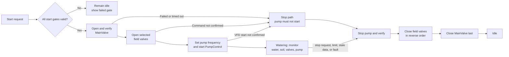
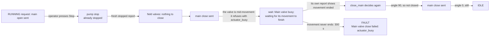
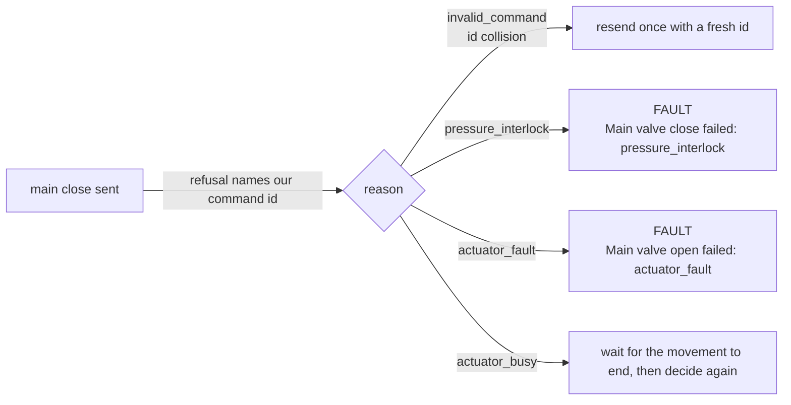
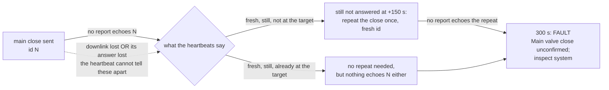
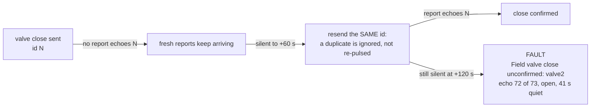
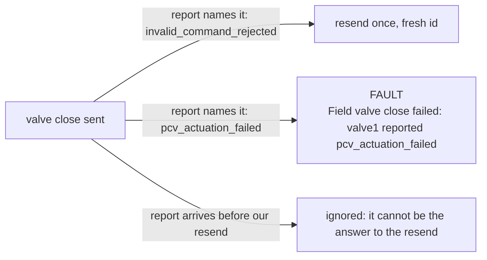
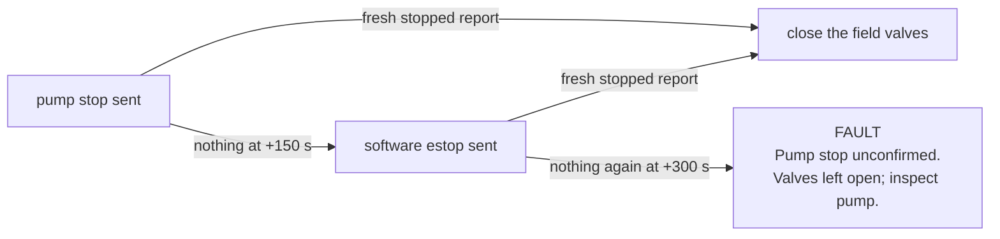
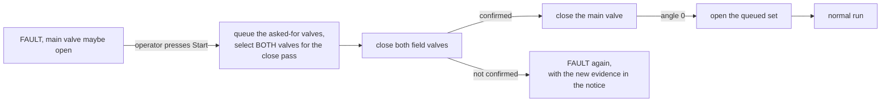

# Watering process cases

This guide describes the operational cases for the deployed irrigation system:
WaterLevel, SoilNode, MainValve, field `valve_1`, field `valve_2`, PumpControl,
ChirpStack/MQTT, and the Integrated Dashboard sequencer.  It is intended for
operators and for finding a failed assumption before it becomes a watering
incident.

## What the status fields mean

Three kinds of evidence are deliberately kept separate in this document.

- **Implemented behavior** is what the current firmware or dashboard source
  does. It can still be configured incorrectly at a site.
- **Hardware-confirmed** means a real installation observation. The valve_1
  TUF-2000M link, unit address 1, 9600 8N1, Modbus RTU, live flow/velocity,
  and `LOW_WORD_FIRST` floating-point layout are confirmed.
- **Unresolved** means the system must not use the value as a safety proof.
  In particular, a field PCV reports the last pulse it generated; it does not
  report a proven physical OPEN or CLOSED position. The XDB401 pressure scale
  is also not yet validated, and WaterLevel's configured five-metre range is
  unconfirmed.

The dashboard must therefore treat a field-valve status as **command feedback**,
not position feedback. A matching command ID proves that the node accepted and
attempted the command; it does not prove that water can pass through the valve.

## System roles

| Part | Normal responsibility | What can be trusted for sequencing |
|---|---|---|
| WaterLevel | Measures reservoir depth and battery; sends Class A telemetry. | A recent valid depth measurement. It receives no application command. |
| SoilNode | Powers its soil probe briefly, reads moisture, temperature and EC, then sends Class A telemetry. | A recent valid soil measurement. |
| MainValve | Moves the motorized inlet/main valve and reads its actuator angle, movement state, fault, and pressure. | Actual angle and completed movement report, subject to current actuator communications. |
| valve_1 | Pulses one latching PCV and reads battery, two prototype pressure channels, plus commissioned TUF flow and totals. | Last command and, separately, valid flow-meter telemetry. It has no position switch. |
| valve_2 | Pulses one latching PCV and reads battery and two prototype pressure channels; it has no flow meter. | Last command only; it has no position switch. |
| PumpControl | Sends VFD frequency/start/stop commands and reads VFD communication, run state, frequency and fault. | A completed command report plus the measured VFD state. |
| ChirpStack, MQTT and Integrated Dashboard | Carries uplinks/downlinks and owns the watering sequence. | Fresh device telemetry and matching command IDs. It cannot repair a lost radio link or prove a latching field valve moved. |

## Normal watering pointer graph

Use the graph from left to right. A failed arrow takes the process to the
matching row in [Fault and abnormal cases](#fault-and-abnormal-cases); it does
not mean that the physical valve state is known.

| Pointer | Required evidence | If the evidence is missing |
|---|---|---|
| A to B | Fresh valid WaterLevel and SoilNode data; main valve and pump healthy; selected field-valve telemetry fresh. | Do not start. Identify the failed start gate. |
| D | MainValve reports the target angle, stable movement completion, and no actuator fault. | Do not start the pump; follow the MainValve fault row. |
| F | Each selected PCV reports the matching command ID and last-commanded `open`. | Do not start the pump. This is not physical proof that the valve opened. |
| G | PumpControl reports the matching command ID and measured VFD running state. | Run the ordered stop path; do not retry automatically. |
| H | Water remains above 19 cm, soil remains below 90%, pump/MainValve/field telemetry is fresh and safe. | Enter the ordered stop path. |
| I to K | Pump is freshly reported stopped before a field-valve close is trusted. | Send one software emergency stop; if it remains unconfirmed, leave valves open and inspect. |

## Timing baseline

These are the current source settings, not measurements of battery life. The
10-second values are commissioning defaults and must not be mistaken for field
settings.

| State | Current cadence or sleep | Operational meaning |
|---|---:|---|
| WaterLevel, current build | 10 s deep sleep | Bench fallback. The prepared field setting is 900 s, but is commented out in `platformio.ini`. |
| WaterLevel, field setting after enable | 900 s deep sleep | Regenerate both dashboard flows when enabling it; their stale limit changes to 1,800 s. |
| SoilNode, current build | 10 s deep sleep | Commissioning default. The source comments identify 600 s as the intended deployment value. |
| SoilNode, intended field timing | 600 s deep sleep | The Integrated Dashboard permits soil data for 1,200 s. Longer operator-selected sleeps require a matching dashboard limit. |
| valve_1 / valve_2, commanded CLOSED | 10 s in the present commissioning builds; use at least 60 s in the field | Class A node wakes, reports, receives one queued command, then sleeps. |
| valve_1 / valve_2, last commanded OPEN | 15 s effective cadence | The firmware shortens Class A deep sleep to improve close-command latency. A configured interval below 15 s remains shorter. |
| MainValve | Awake; 60 s heartbeat | Class C normally receives commands without waiting for an uplink. Movement status is also sent promptly. |
| PumpControl, stopped / running | Awake; 60 s / 15 s heartbeat | GPIO27 AUTO/MANUAL state is also reported. |
| Dashboard safety tick | 5 s | Checks freshness and advances or stops a run. |

## Basic cases

### Case 1 — Automatic watering starts normally

The operator selects `valve_1`, `valve_2`, or both, then presses Start. The
zone checkboxes are then locked until the sequence is back in `idle` (or in
`fault`, where a start retries the close pass), because a run's valves are fixed
the moment it starts: a box ticked during a run changes nothing physically, and
the panel would otherwise show a set that is not the one watering. Locked, the
boxes show the valves the current run is using, and Start during a teardown
queues a repeat of that same set. A `select` message is ignored in the same
phases on the server, so a stale second tab that still shows idle cannot reshape
the next run either.

The dashboard permits the run only when all of these are true:

1. WaterLevel is fresh, valid, and at least **20 cm**.
2. SoilNode is fresh and valid, and moisture is below **70%**.
3. MainValve is fresh, has no actuator fault or overpressure flag, and is
   reachable.
4. PumpControl is fresh, communicating with the VFD, has a valid configuration,
   has no VFD fault, and is stopped.
5. Every selected field valve has fresh status.

The dashboard then opens and verifies MainValve at the configured 90-degree
target, opens each selected field valve one at a time, sets the pump to 25 Hz,
rechecks all conditions, and starts the pump. It enters `running` only after
PumpControl reports the matching command ID and measured running state.

During watering, expected reporting is: PumpControl every 15 s, each selected
field valve every 15 s, MainValve at least every 60 s, and WaterLevel/SoilNode
at their configured sleep periods. The current maximum watering duration is
four hours.

### Case 2 — Water is available but soil is already wet

If soil moisture is **70% or higher**, the dashboard does not open a valve or
start the pump. All nodes remain in their normal idle timing. This is a normal
refusal, not a fault.

### Case 3 — Reservoir is below the start level

If the valid water depth is below **20 cm**, the dashboard refuses to start.
WaterLevel continues its normal reporting sleep; no remote sleep change is
available in the current WaterLevel firmware.

### Case 4 — Normal stop

A stop request, soil moisture at or above **90%**, water at or below **19 cm**,
the four-hour limit, or an unsafe running condition enters the same ordered
shutdown:

1. Stop the pump and wait for a fresh stopped report.
2. Close selected field valves in reverse order.
3. Close MainValve last.

The order matters: it avoids closing valves around a pump that is still
reported as running. A completed MainValve close is physically checked by its
actuator angle; field-valve close remains only a successful latching-pulse
report.

## Fault and abnormal cases

The table states current behavior first. “Hold 15 s” is an **operational
recommendation** for a future fault-watch state; the present PCV firmware only
uses 15 s while its *last commanded* state is OPEN. It does not automatically
enter a fault-watch state after an unconfirmed CLOSE.

| Case | How it is detected now | Current system response | Timing while it is unresolved | Required operator conclusion |
|---|---|---|---|---|
| WaterLevel uplink missing or measurement invalid | Water data becomes stale after 60 s on the 10 s bench build, or 1,800 s after the 900 s field setting. | Start is refused; a running sequence stops. | No live sleep update exists. Keep its configured period; a faster diagnostic period requires a rebuild/configuration change. | Check sensor power, RS485, OTAA/join, and the depth reading before restarting. |
| Soil telemetry missing or invalid | Dashboard freshness limit is 1,200 s; invalid payload clears `sensor_valid`. | Start is refused; a running sequence stops. | Current firmware keeps its stored sleep. A valid Class A command can set SoilNode to a proposed 60 s diagnostic interval, then return it to 600 s after recovery. | Check switched sensor power, RS485 response and probe condition. |
| MainValve does not move, reports busy/fault, or times out | Actuator reports movement/fault, named in the notice; firmware movement timeout is 180 s and dashboard command timeout is 300 s. | Pump is never started, or the running sequence starts shutdown. | MainValve is awake and reports at least every 60 s; it has no deep sleep. | Inspect actuator, RS485 mode, local override, target angle and pressure interlock. |
| MainValve refuses a command (`rejected`) | The refusal names the command it answers in `reported_command_id`; the sequencer acts only on that. A reused command id is resent once. `actuator_busy` means a movement was already in flight, so the sequence waits for it to end and then decides again. A pressure interlock or an actuator fault is not retried. | The shutdown path runs and the notice names the reason (`Main valve close failed: pressure_interlock`); a busy valve shows `Main valve busy; waiting for its movement to finish` and no fault. | The wait is bounded by the 300 s command deadline, which clears the firmware's 180 s movement timeout, so a movement that never ends still faults. | Act on the reason: an interlock is physics, an actuator fault needs the actuator, and a busy valve only needs waiting. |
| MainValve never answers a command | No correlated report and the refusal event was lost — the heartbeat after it carries the *last* event's phase and id, not a repeat of the refusal. The angle is measured position, so the wait is also judged on state: fresh, still, and not at the requested angle means the command never landed. One repeat goes out at 150 s (half the deadline). | The notice reads `Main valve close unconfirmed; repeating once` and the sequence continues; a second silence faults at 300 s as before. | The repeat is bounded by the same 300 s deadline. | A repeat that also goes unanswered is a radio or actuator fault to diagnose; the earlier notice says which of the two happened. |
| MainValve pressure is invalid | The current remote-move setting does **not** require valid pressure. | Dashboard does not block solely on invalid pressure unless another main-valve field is bad. | Awake; 60 s heartbeat. | Treat this as a safety gap: validate and enable the required pressure interlock before relying on unattended pressure protection. |
| MainValve overpressure | MainValve reports `overpressure`; the sequencer detects it. | Start is refused, or the pump-stop sequence begins. | Awake; 60 s heartbeat, plus status events. | Do not simply retry the close command. The firmware currently rejects movement that closes farther during upstream overpressure; after the pump is confirmed stopped, inspect whether that rule also prevents the required final close. |
| Pump start is not confirmed | Matching command ID never reaches final VFD running state within 150 s. | The sequencer runs the shutdown path; it does not retry Start automatically. | Pump stays awake. It reports every 15 s if running, otherwise every 60 s. | Check VFD fault, Modbus link, armed frequency and pump hydraulics. |
| Pump stop is not confirmed | No matching final stopped state within 150 s. | Dashboard sends one software `estop`. If that is not confirmed, it enters fault and deliberately leaves valves open. | Pump stays awake; use the 15 s running heartbeat while it may still run. | Treat as an emergency inspection. A network `estop` is not a physical emergency-stop circuit. |
| Field-valve OPEN command is not acknowledged | The valve echoes no id at all: one repeat of the same command goes out at 60 s (half `fieldValveCommandTimeoutSec`), and silence past 120 s faults. | Pump is not started; shutdown is requested. | If the valve had reported OPEN, it is already at 15 s. If it remained CLOSED/unknown, current cadence may be the configured closed interval. | Check Class A downlink queue, OTAA session, battery, pulse circuit, polarity and solenoid. The fault names what the valve last reported, so read that before resending anything further. |
| Field valve is broken, stuck closed, or closes unexpectedly while commanded OPEN | **Not reliably detectable now.** A PCV can report `open` after a successful pulse even if its mechanism did not move. valve_2 has no flow meter. | The sequence can continue until another condition stops it or the four-hour limit expires. | valve_1/2 report every 15 s only because their last command is OPEN; this is telemetry, not proof of flow. | This is the principal unattended-watering gap. Add proven valve-position feedback or a commissioned per-zone flow/pressure interlock before treating this case as safe. |
| Field-valve CLOSE command is unconfirmed | The valve echoes no id at all: one repeat of the same command goes out at 60 s (half `fieldValveCommandTimeoutSec`), and silence past 120 s faults. | Dashboard enters fault after the pump stop has been confirmed; MainValve is not closed automatically. **The no-repeat policy of 2026-10-07 is amended: one same-id repeat, then the detector stands. Confirmed by the operator 2026-10-08 after a live stalled close.** | Current CLOSE state can fall back to 60 s field cadence. A future fault-watch state should hold 15 s for up to the existing 120 s timeout. | Inspect the physical valve and water path. Do not assume a reported CLOSE stopped flow. |

Two notes on that row, added after testing on 2026-10-07. First, the fault
leaves the main valve open — observed live as `main 90°, valve1 open, pump
stopped, phase fault`. No water can flow because the pump is already confirmed
stopped, but the supply stays connected to a field valve whose state is unknown,
and the fault is terminal until an operator stops. Change that behaviour only as
a conscious policy change. Second, a field-valve command that goes unanswered is
repeated **once, with the same command id**, at half the deadline; the timeout is
still the failure detector and the fault still ends the sequence. A downlink
that is published but never applied therefore costs at most the repeat plus the
remaining wait. That was seen twice on 2026-10-07 (one main-valve open, one
field-valve close), and in the second case re-issuing the same close was
confirmed by the device within five seconds — which is where this repeat comes
from. The same id matters: a PCV accepts an identical repeat as a duplicate
instead of pulsing the solenoid again, and it reports the id it holds either way,
so a close that landed but was never reported confirms on the repeat, while a
close that was lost is simply applied. MainValve gets the same single repeat, on
the same half-deadline rule, with a fresh id and judged on its measured angle
instead of an echo: its refusal is a one-shot event, so one lost uplink otherwise
left a run waiting on an answer that could not come — observed live on
2026-10-08 with the valve idle at 90°, the refusal's uplink lost, and the run
recovering only when the repeat landed. A lost downlink is still a device or
radio-side fault to diagnose; the field-valve fault message now carries what the
valve last reported (`echo <id> of <sent>, <last state>, <age> quiet`) so that
diagnosis starts from evidence. This amends the 2026-10-07 "never retry a
field-valve command" choice at the operator's request on 2026-10-08, after a
stopped run sat unconfirmed for the full 120 s.

A third note, added 2026-10-08 after those two events were reproduced off-line.
MainValve repeats the phase and reason of its last status *event* in every later
heartbeat (bytes 17 and 2), so a refusal from an earlier cycle was still in the
payload when the next command went out; the sequencer read it as the answer to
that command. One stale `rejected` therefore failed the next open without the
valve ever being given its chance to move, and the close that followed reported
"Main valve close unconfirmed; inspect system" with the valve still shut — the
two 2026-10-07 events, in the order they happened. The dashboard now acts on a
status only when it arrived after the command was sent and names it
(`reported_command_id` for MainValve, the send time for the field valves and the
pump). A correlated refusal is resent once only for a reused id; the reason is
now named in the notice, and `retry` is no longer spent on hardware refusals.
The firmware side still repeats a stale phase, which is why the correlation is in
the dashboard; the MainValve card had the same guard already.
| valve_1 flow missing, zero, or TUF error bits present during a run | valve_1 telemetry provides flow, velocity and TUF errors. | The current sequencer does **not** use a minimum-flow interlock. | valve_1 remains at 15 s while commanded OPEN. | Use the data diagnostically now. Implement a commissioned minimum-flow/time-after-pump-start interlock before using it to stop runs automatically. |
| Radio/OTAA failure on a Class A node | Missing uplinks; a queued downlink cannot reach a sleeping node until its next uplink. | Dashboard marks the node stale and fails closed for Start; a running sequence starts shutdown when its required telemetry becomes stale. | The node continues its stored timer sleep. No dashboard command can reduce it until the node rejoins and opens RX1/RX2. | Diagnose power, credentials, nonce storage, gateway coverage and ChirpStack queue. |
| Node reboot or last PCV state unknown | Latching PCV starts with physical position unknown after reset. | Firmware sends no pulse at boot. Dashboard must wait for fresh telemetry. | Normal current interval resumes; a device that last reported OPEN gets the 15 s cadence only if that state was retained. | Inspect a field valve before resuming an interrupted watering run. |

## Case progress charts

One chart per case, left to right. Every arrow carries the condition that lets the
sequence move on — that condition *is* the check, and it is the only thing standing
between a healthy run and a fault. Times are the current source settings, not
measurements. Every `wait_*` node is a place the sequence can look idle; each has a
deadline that ends it, and no wait can hang (the bounded-exit matrix in
`examples/IntegratedDashboard/README.md` proves that in-process for every one of them).

### Case 1 — normal run and stop

Measured live 2026-10-08: start 47–60 s (the main valve alone travels ~23 s), teardown
53–55 s of which the pump stop is 14–16 s.

### Case 2 — Stop while the main valve is still opening

Confirmed live: refusal at +16 s, movement ended +8 s later, idle at +53 s, no fault.
The wait is held in sequencer state, not in the device's phase field, because the
movement's own `finished` event replaces the refusal in the status payload.

### Case 3 — MainValve refuses with hardware or physics behind it

Only `invalid_command` is retried: the refusal uplink carries the id the device holds,
so the shared counter catches up. The others are physics or hardware and are named
instead of being papered over.

### Case 4 — MainValve never answers (the case that keeps biting)

**This is the open one.** The refusal and the acceptance are both one-shot *events*; the
heartbeat after them carries the last event's phase and id instead of repeating it, so a
lost uplink loses the answer for good. Live 2026-10-08, twice: close 103 refused `busy`
with its refusal lost (recovered by the repeat), and close 112 with no answer at all,
valve idle at 90°, ending in the fault above. Whether the device received the close is
**not decidable from the dashboard** — the device's serial log, or a capture of
`application/.../command/down`, is the only way to tell "downlink lost" from "answer
lost". That is what to check next.

### Case 5 — field valve never answers

The same id is deliberate: a PCV accepts an identical repeat as a duplicate instead of
pulsing the solenoid again, and it echoes the id it holds either way — so a close that
landed but was never reported confirms on the repeat, while a lost one is applied.
Confirmed live: "resent once" at 19:12:44, closed 6 s later.

### Case 6 — field valve reports a refusal

### Case 7 — pump stop not confirmed

Observed live: 14–16 s normally; one run took the full 150 s and escalated to `estop`
before the teardown continued. That is the pump being slow, not the dashboard.

### Case 8 — Start after a fault

### Where each case can stall, and what ends it

| Wait | Waits for | Deadline | When the deadline passes |
| --- | --- | --- | --- |
| `wait_main_open` / `wait_main_close` | main valve saying it reached the angle | 300 s | repeat once at 150 s, then fault and name it |
| `wait_field_open` / `wait_field_close` | the valve echoing our id | 120 s | repeat the same id at 60 s, then fault with the valve's last report |
| `wait_frequency` | frequency armed | 150 s | stop the start, or shutdown if already running |
| `wait_pump_start` | VFD reporting running | 150 s | shutdown, do not retry the start |
| `wait_pump_stop` | a fresh stopped report | 150 s | one software `estop`, then fault with the valves left open |

## Fault-time policy to add before unattended operation

These timing changes are a proposed operations policy, not current firmware.
They make a fault visible faster without asserting a physical result that the
hardware cannot measure.

| Situation | Proposed temporary cadence | Return condition |
|---|---:|---|
| Soil sensor responds invalidly but radio is healthy | 60 s SoilNode sleep | Three consecutive valid readings, then restore 600 s. |
| WaterLevel sensor is invalid or stale during a field deployment | 60 s diagnostic sleep | Three valid depth reports, then restore 900 s. This needs a WaterLevel configuration/reflash or a new downlink command. |
| A selected field valve is commanded OPEN or its CLOSE outcome is uncertain | 15 s field-valve report/sleep | A future *physical* feedback or flow interlock verifies the outcome; otherwise lock out and require inspection after 300 s. |
| Pump command is pending or pump may still run | 15 s PumpControl status | Matching final VFD state; then return to 60 s stopped cadence. |
| MainValve movement is pending or faulted | Continue awake, publish a status event and keep the 60 s heartbeat | Actuator fault cleared and a successful, stable target report received. |

Do not implement the policy by merely changing dashboard stale limits. For a
Class A device, the device's actual timer, its accepted command result, and the
dashboard freshness threshold must be changed together. WaterLevel is special:
its current firmware deliberately ignores application downlinks, so its
interval cannot be changed remotely.

## Bugs and safety gaps this guide exposes

1. **A reported field-valve state is not physical proof.** A broken valve or an
   unexpected closure cannot be reliably detected from valve_1/valve_2 status.
   valve_1 flow is available but not currently enforced by the sequencer;
   valve_2 has no flow measurement.
2. **The dashboard does not require valid MainValve pressure for a remote
   move.** The firmware sets `REQUIRE_VALID_PRESSURE_FOR_REMOTE_MOVE` to
   `false`. This needs a conscious site safety decision.
3. **Upstream-overpressure protection can impede the final MainValve close.**
   The current MainValve rule rejects any command that closes farther while
   upstream pressure is high. The dashboard stops the pump first, but must be
   tested to confirm it can then complete the final close rather than remain in
   the fault state with MainValve open. Since 2026-10-08 that case is at least
   named: the correlated `pressure_interlock` refusal is not retried and faults
   as `Main valve close failed: pressure_interlock` instead of waiting out the
   300 s and reporting a bare `close unconfirmed`. Whether the interlock clears
   after the pump stops is still unverified on hardware.
4. **WaterLevel's local GPIO27 load decision uses battery voltage only.** The
   water-level threshold is commented out in the firmware, so the output is
   not a local low-water lockout.
5. **Changing a sleep interval without matching the dashboard freshness limit
   produces false failures or late fault detection.** WaterLevel has builders
   to keep this synchronized. SoilNode and field valves need the same
   operational discipline when their stored Class A intervals change.
6. **In Class A the report interval is also the join-retry period.** Every exit
   path of the wake cycle, including a failed join, deep-sleeps the configured
   interval; `JOIN_RETRY_INTERVAL_MS` (60 s) is used only by the Class C paths.
   At the 10 s and 60 s settings in use this is harmless — a lost join retries
   in about the same time either way. Above roughly five minutes it becomes a
   recovery trap: one lost join, or a cold boot while the join server is
   unreachable, silences the node for the whole interval. The interval is
   persisted in RTC memory and in NVS, so a long test `sleep_seconds` downlink
   outlives a reflash. Before shipping any interval above five minutes, give
   `enterDeepSleep` a seconds parameter and pass the join-retry interval when
   the cycle did not complete a join plus uplink. The successful path is
   unaffected.
7. **A MainValve still moving when the next command arrives** (fixed 2026-10-08,
   confirmed live). The firmware runs one movement at a time and refuses any
   command that arrives while one is active (`actuator_busy`), so pressing Stop
   while the main valve was opening refused the close and faulted with the valve
   left open — the case an operator hit on 2026-10-08. The sequence now waits for
   the valve's own report to show the movement finished (its 180 s movement
   timeout fits inside the 300 s deadline), then re-enters `close_main` /
   `open_main`: the valve is closed if it reached its target angle, or held there
   if the wait was for an open. Residual: a movement that never ends — a valve
   stuck part-way — is still a fault, now bounded at 300 s and named
   `Main valve close failed: actuator_busy`.

## Source basis

- Implemented sequence, thresholds, timeouts and freshness rules:
  [`tools/build_irrigation_dashboard.py`](../tools/build_irrigation_dashboard.py),
  `SETTINGS` and `CONTROL`.
- Node cycles and integration constraints:
  [`examples/IntegratedDashboard/README.md`](../examples/IntegratedDashboard/README.md),
  “Single-page irrigation dashboard”; [`examples/WaterLevel/README.md`](../examples/WaterLevel/README.md),
  “Staleness”; and the individual node READMEs.
- Current project decisions and PCV feedback limitations:
  [`CURRENT_PROJECT_CONTEXT.md`](CURRENT_PROJECT_CONTEXT.md), “Battery and
  energy requirement” and “Current valve command and feedback behavior”.
- TUF facts and confirmed installation observations:
  [`TUF_2000M_TS2.md`](TUF_2000M_TS2.md), “Manual facts: RS485 and Modbus RTU
  protocol” (technical manual PDF pp. 39-45) and “Hardware-confirmed REAL4
  word order”.
- RD-RWG-01 manual facts and the local-level-gate mismatch:
  [`RD_RWG_01.md`](RD_RWG_01.md), “Manual facts” (user manual p. 2 and pp. 3-5)
  and “Unresolved items and commissioning status”.
